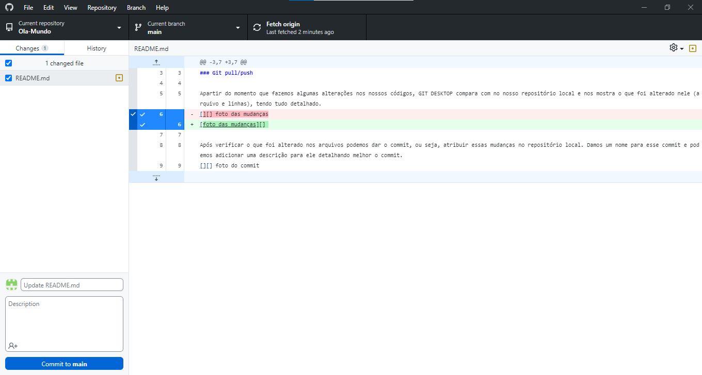
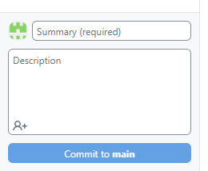

# Repositorio de estudo!

### Git pull/push

Apartir do momento que fazemos algumas alterações nos nossos códigos, <b style="color: red;">Texto em vermelho</b> compara com no nosso repositório local e nos mostra o que foi alterado nele (arquivo e linhas), tendo tudo detalhado.

Após verificar o que foi alterado nos arquivos podemos dar o commit, ou seja, atribuir essas mudanças no repositório local. Damos um nome para esse commit e podemos adicionar uma descrição para ele detalhando melhor o commit. Para "commitar" clique _"`commit to main`"_ ou utilize o comando `CTRL+enter`.

Após "commitar" o seu códiigo, você precisa subir ele para o github, clique em _"`pull origin`"_ ou utilize o comando `CRTL+P`

Depois de dar commit em todos os arquivos, devemos subir ele para o nosso repositório publico, clicando em `push `

> Guia das siglas do Git
1. M (Modify): Mostra para o usuario que o arquivo está diferente do que está salvo localmente no seu git
2. U (untracked): Mostra para o usuario que o arquivo ainda não existe no repositório até ele dar o 1° commit com o arquivo novo
3. 