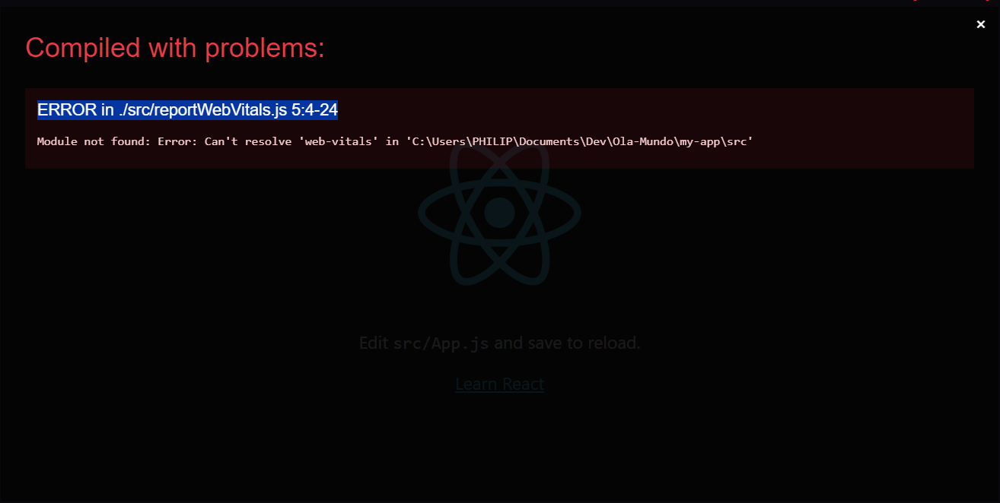

 # REACT - DANKI CODE

### INSTALAÇÃO DO REACT NA SUA MAQUINA
 Primeiro nos devemos criar nosso `react-app` e iniciar o servidor nele, através dos seguintes comandos

 ```
 npx create-react-app [nome_do_app] - cria a pasta com os arquivos do REACT
 cd [nome_do_app] - Acessa a pasta criada
 npm start - Inicia o servidor local do REACT
 ```
 
 Caso ele retoner o erro `ERROR in ./src/reportWebVitals.js 5:4-24`:
 
 basta executar o seguinte comando no terminal
 ```npm i web-vitals --save-dev```

### ESTRUTURA DO REACT
 O REACT é baseado em umma linguagem compilada, ou seja, fazemos todo o desevolvimento do site e depois compilamos os arquivos, isso que faz gerar a pasta public e tudo que é visto pelo usuário

 **1. PASTAS**
 - ***node_modules***
 - ***public***: Possui o arquivo index.html que é a unica que vai mostrar para o usuário quando ele   inspecionar o site
 - ***src***: Local onde fica toda a mainupulação e criação do site. Possuindo os sequintes arquivos
 ```
 app.js - Local de desenvolvimento (auto compila para o servidor local)
 app.css - Onde iremos fazer toda nossa estilização do app
 App.test.js - Pode deletar (Pesquisar sobre)
 index.css
 index.js
 logo.svg - Pode ser deletado (remover linha 1 do app.js, ela faz uma requisição de import, pode gerar erro)
 reportWebVitals.js - Pode deletar (Pesquisar sobre; Deletar linhas 5, 14-17 do index.js)
 setupTests.js - Pode deletar (Pesquisar sobre)
 ```

 O REACT é trabalhado através de camadas. Para iniciarmos nossa aplicação devemos solicitar ela com o `.render` 
 e adiciona o componentes que queremos mostrar (`<app />`) e por ultimo passamos aonde iremos colocar o nosso app para ser visualizado
 (`document.getElementById('root')`)

### COMPONENTES
 O que são componentes?

 São pequenos blocos de codigos que ao ser invocados vão construindo a estrutura do site.

 Para que possamos transformar os nossos componetes em `componetes dinamicos` podemo utilizar os chamados
 ***`props`***. ***`Props`*** são argumento que passamos para os componentes para podermos manipular ele 
 de acordo com a nossa necessidade.
 ```
 function App(props) {
  return (
    <div className="App">
      <h1>{props.texto}</h1>
    </div>
  );
 }

 root.render(
  <React.StrictMode>
    <App texto="Olá, Mundo!"/>
    <App texto="Olá, React App!"/>
  </React.StrictMode>
 );
 ```

 Porem ficar colocando ***`Props.propriedade`*** deixa o código um pouco confuso e cheio. Podemos transformar esse obj no nome da propriedade, passando ela direto utilizando ***``***, em que, colocamos as propriedades dentro das chaves:

 ```
 function Person({name, urlImg, description}) {
    return (
        <div className="Card">
            <h3 className="Card__name">{name}</h3>
            
            <p className="Card__description">{description}</p>
        </div>
    )
}
```

### CRIAR COMPONENTES PROPRIOS

 Para criar um componente podemos reutilizar a estrutura do app,js e alterar seus nome

### REACT FRAGMENTS
 
 É uma forma de criação de componentes que não depende de um elemento pai, utilizamos um placeholder, permitindo alocar diversos componetes filhos, ajuda na simplificação do código

### HOOKS

HOOK de estado:

Para utilizar o hook de estados, precisamos de 2 "variaveis" (o valor que ira receber e o valor que ira setar)

```
const [name, setName] = useState("");
```

### EXTRA:
 Metodologia BEM (BLOCK ELEMENT MODIFIER)
 
 Block: Elemento Pai

 Element: Elementos filhos do elemento pai

 Modifier: É um elemento já criado que possui uma estilzação diferente do padrão
